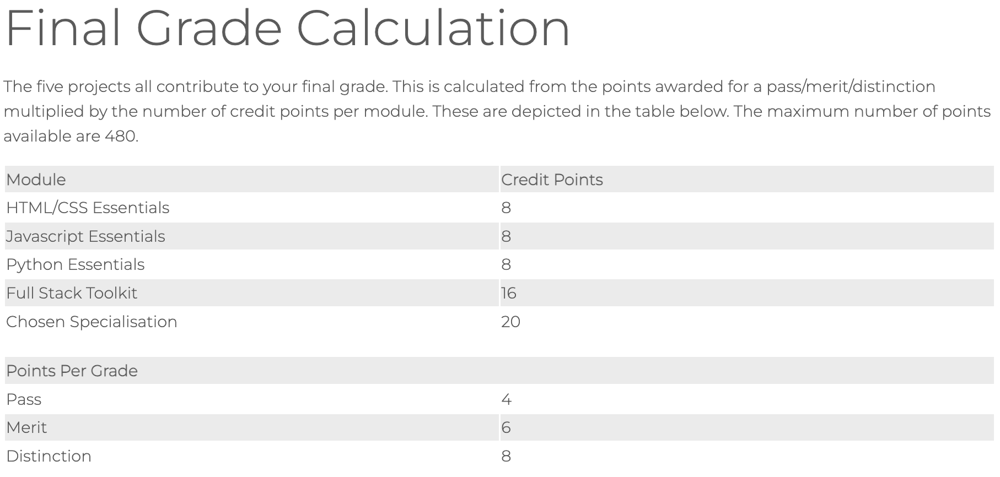
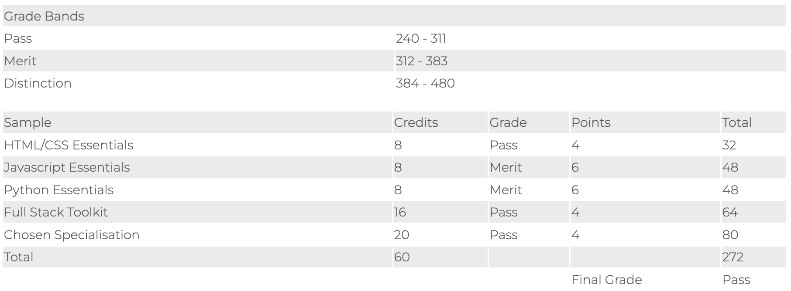

# HOW IS YOUR DIPLOMA GRADE CALCULATED??

## ASSESSMENT CRITERIA :
- [PP1](https://learn.codeinstitute.net/courses/course-v1:CodeInstitute+CSSE_PAGPPF+2021_Q2/courseware/66cf361c769a41d496f5001fae6f9be7/3b5cd5dc8313462aa5975a3c9b9a1a3c/)
- [PP2](https://learn.codeinstitute.net/courses/course-v1:CodeInstitute+JSE_PAGPPF+2021_Q2/courseware/30137de05cd847d1a6b6d2c7338c4655/c3bd296fe9d643af86e76e830e1470dd/)
- [PP3](https://learn.codeinstitute.net/courses/course-v1:CodeInstitute+PE_PAGP+2021_Q2/courseware/40cd7850a24d454795ec611831b06b77/980b1952a3a64898ab4010759bd0bd6a/)
- [PP4](https://learn.codeinstitute.net/courses/course-v1:CodeInstitute+FST_PAGP+2021_Q2/courseware/e5bc285d9a5448269dc29cefa3119d55/5672a8bbeb1240c1bbbe2b9bd77440b0/)
- [PP5 - Advanced Frontend](https://learn.codeinstitute.net/courses/course-v1:CodeInstitute+AFE_PAGPPF+2/courseware/f05f0d6831504e4dba3b3868106a356a/c14fc37360f7419786cd57d6b65cfc95/)
- [PP5 - eCommerce](https://learn.codeinstitute.net/courses/course-v1:CodeInstitute+ECOMM_PAGPPF+2021_Q2/courseware/c38cb7ad50e9443dbd94f4cef3fed1ae/0b467723b3f54a5db85c975fdf67116d/)