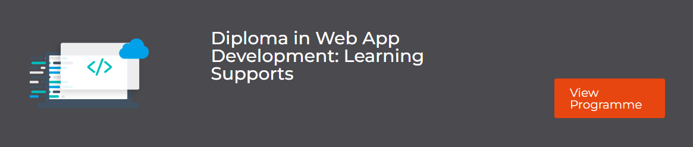

# PROJECT SUBMISSION :

The following is the message sent out by C.I.:

```
We hope you are well.
We just wanted to send a reminder on how to submit your projects.
When you have a project that is ready to submit, please go to your LMS dashboard and select the Diploma in Web App Development: Learning Supports option and follow the instructions.
Please see below an example of this in the LMS:
Please remember also that all projects must be submitted by 12:00 PM (noon), Irish and UK time, on/before the deadline date.
If there are issues with meeting your deadlines, you must inform Student Care in a timely manner and we can go through available options with you.
If you have any questions about this or anything else, please feel free to reach out to us.
```

- Contact: studentcare@codeinstitute.net
- LMS: [Dashboard](https://learn.codeinstitute.net/dashboard)


